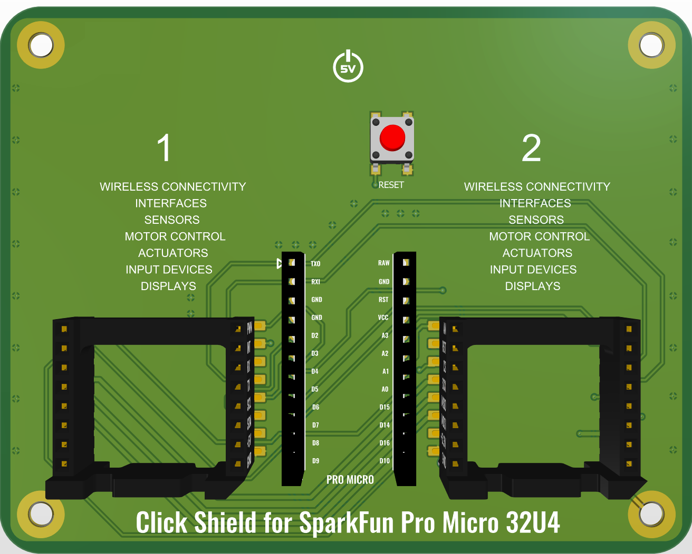
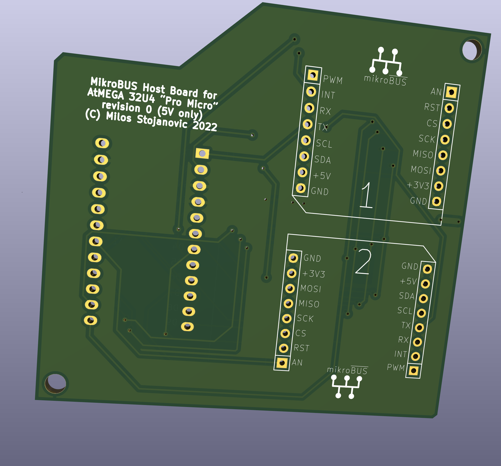
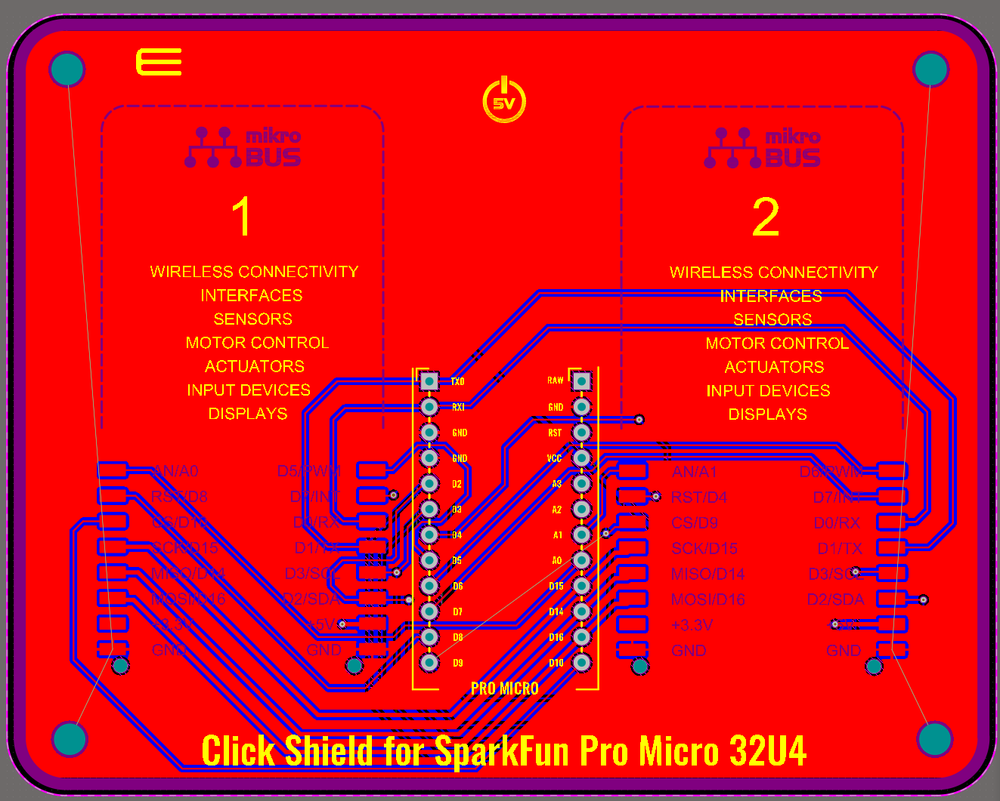

# Pro Micro Shield for mikroBUS click
Arduino Pro Micro shield PCB design for connecting 2 mikroBUS click boards.

This is my long borne idea for an Arduino Pro Micro shield for supporting mikroBUS click cards.
**After offering the idea to MikroElektronika team, together with a similar DUE shield, they accepted, I implemented it all, they said design is accepted and sent samples of one of the boards for me to test, then stopped responding to both mail and phone to me. For 3 months. After this, they inform me they have their own design and are not going to need mine :D Funny those guys, eh? Almost as funny as myself investing >500 euros in their overpriced click shields. But they rather pull this instead of paying their own offer of 200 euros per design.**
So I am hereby publishing my initial, kiCad designs of these pcbs, that do not contain any of the proprietary templates mikroe sent me to create the final versions.

Soon, a version with optional 5v-3.3v voltage level converters shall be added. Components used are going to be the cheapest such converters from aliexpress, with solder jumper activation.

Currently, Gerber files for Pro Micro mikroBUS shield, with versions for through hole and SMD mikroBUS socket.
Source files for PCB design are available only for KiCad 6, for though hole mikroBUS sockets only.

Enjoy the design. It is fully opensource, aGPL3 license.

Also, you might want to consider [OpenGiveBack.org](https://opengiveback.org/) guidelines if you intend to sell these designs.
